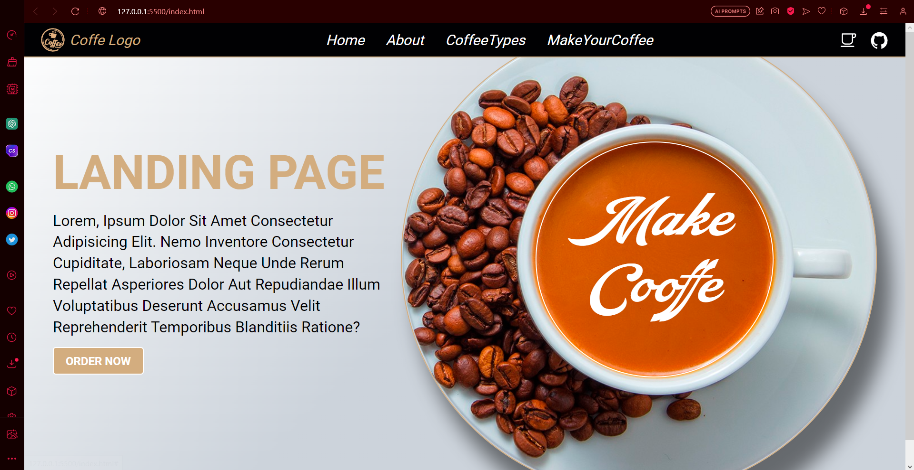

# Make a Coffee - by MAUROPEPA

## Deploy GitHub-Page

**Make a Coffee** is an elegant and responsive landing page designed by MAUROPEPA for coffee enthusiasts. This project showcases a visually appealing website with a coffee theme.



## Key Features
- **Responsive Design**: The website is fully responsive and adapts seamlessly to different screen sizes, ensuring an optimal experience on both desktop and mobile devices.

- **Interactive Navigation**: The navigation menu is user-friendly and provides easy access to various sections of the website, including Home, About, Coffee Types, and the "Make Your Coffee" feature.

- **Coffee-themed Styling**: The website uses a coffee-themed color palette and fonts, creating a visually appealing and immersive coffee experience.

- **Striking Coffee Image**: The homepage features a captivating coffee image that sets the mood and contributes to the coffee-centric ambiance.

## Technologies Used
- HTML5
- CSS3
- JavaScript (Ionicons for icons)

## Installation
1. Clone this repository to your local machine:
   ```bash
   git clone https://github.com/your-username/make-a-coffee.git

## Developed

Contact: [Mauro Pepa's GitHub](https://github.com/PEPAXD)

## License
- This project is licensed under the MIT License. See the LICENSE file for more details.
Explore the world of coffee on Make a Coffee by MAUROPEPA and enjoy!
